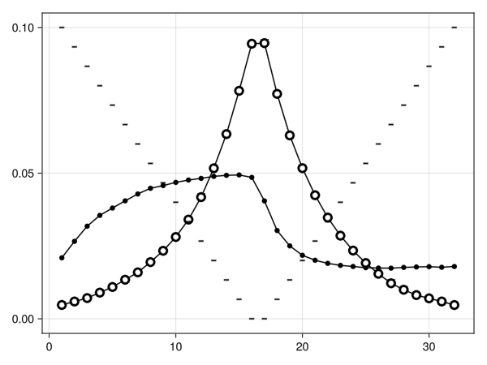
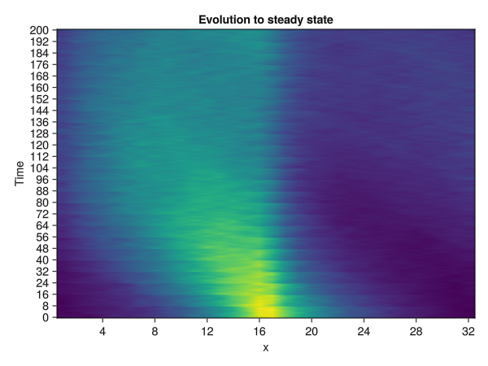
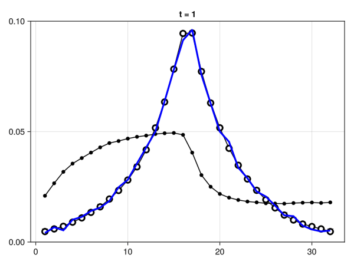
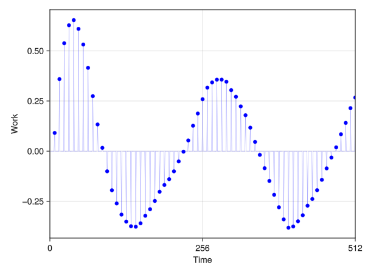
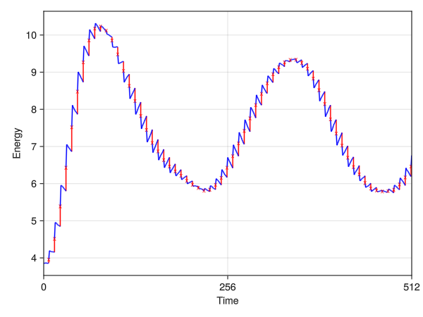

````julia
using GLMakie, LinearAlgebra, ProgressMeter, Distributions
````

Here, we reproduce the example model of [Crooks' 1999 paper, "Entropy production fluctuation theorem and the nonequilibrium work relation for free energy differences"](https://arxiv.org/pdf/cond-mat/9901352.pdf).
The model, quoting directly from Crooks, is:

> A single particle occupies [one of 32 possible] positions in a one-dimensional
> box with periodic boundaries, and is coupled to a heat bath of
> temperature $T = 5$. The energy surface, $E(x)$, is [given by $\lvert x - (x_0 + 1/2) \rvert$, with $x_0$ some particular site].
> At each discrete time step the particle attempts to move
> left, right, or stay put with equal probability. The move is accepted
> with the standard Metropolis acceptance probability [$= \exp(-\Delta E/T)$]. Every
> eight time steps, the energy surface moves right one position. Thus
> the system is driven away from equilibrium, and eventually settles
> into a time symmetric nonequilibrium steady state.

First, we implement the periodic motion of the energy surface by
defining the center position $x_0$ as a function of time:

````julia
box_size = 32
time_between_shifts = 8
x0(t) = mod1(div(t,time_between_shifts),box_size)
````

Next, we define the energy surface at $t=0$:

````julia
initial_energy_surface = [0:15 ; 15:-1:0]
````

Now, the energy function $E(x,t)$ simply indexes the $t=0$ at the appropriate offset:

````julia
energy_function(x,t) = initial_energy_surface[mod1(x - x0(t),box_size)]
````

With the energy surface established, we can write the standard Metropolis algorithm for
taking one step:

````julia
metropolis(ΔE,kT) = exp(-ΔE/kT)

function make_step(x0,t;kT = 5)
  # Move left, right, or stay (equal probability)
  step = rand([-1,0,1])
  if step == 0
    return x0, 0. # If staying, no need to check anything
  end

  # Periodic boundaries
  new_x = mod1(x0+step,box_size)

  # Move with probability exp(-ΔE/kT), i.e. exponentially
  # small in the amount of heat imported from the bath
  e_stay, e_move = energy_function.([x0,new_x],t)
  heat_imported_from_bath_by_step = e_move - e_stay
  if rand() < metropolis(heat_imported_from_bath_by_step,kT)
    new_x, heat_imported_from_bath_by_step
  else
    x0, 0.
  end
end
````

We additionally return the amount of heat the bath gives to the system during the step.

Before doing any sampling, we need to "burn in" to avoid biasing
the distribution with our choice of initial state.
After the burn in period, we begin accumulating statistics.

````julia
function take_samples(f;n_burn = 10_000,n_sample = 1_000_000)
  # Burn in
  for j = 1:n_burn
    f(false) # Flag that this is the burn in period; don't take stats
  end

  # Sample
  for j = 1:n_sample
    f(true) # Flag that statistics should be taken
  end
end
````

First, we calculate the nonequilibrium steady state distribution
by letting the energy surface move in time and recording a histogram
of the position relative to $x_0$:

````julia
hist_ss = zeros(Int64,32)
x_cur = 0
t_cur = 0

take_samples() do take_stats
  global x_cur, t_cur
  # Make a step, and increment the time
  x_cur, _ = make_step(x_cur,t_cur)
  t_cur = t_cur + 1
  if take_stats
    # Record the position in the frame of x0
    hist_ss[mod1(x_cur - x0(t_cur),box_size)] += 1
  end
end
````

Next, we calculate the equilibrium distribution when the
energy surface is frozen in time by fixing $t=0$:

````julia
hist_eq = zeros(Int64,32)
x_cur = 0

take_samples() do take_stats
  global x_cur
  # Frozen at t = 0
  x_cur, _ = make_step(x_cur,0)

  if take_stats
    hist_eq[mod1(x_cur - x0(0),box_size)] += 1
  end
end
````

Finally, plot the results:

````julia
# Rotate the energy minimum to the center
Ix = sortperm(mod1.(-15:16,box_size))
in_frame(x) = x[Ix]

# Compute probability from histogram counts
p_ss = hist_ss ./ sum(hist_ss)
p_eq = hist_eq ./ sum(hist_eq)

f = Figure(); ax = Axis(f[1,1])
plot!(ax,in_frame(p_ss),color = :black)
lines!(ax,in_frame(p_ss),color = :black)

lines!(ax,in_frame(p_eq),color = :black)
scatter!(ax,in_frame(p_eq),color = :white, strokewidth = 3,strokecolor = :black)

# Rescale energy to fit in plot
plot!(ax,0.1/15 * in_frame(initial_energy_surface),marker = '-',color = :black,markersize = 25)
````


The non-equilibrium steady state (black dots) resembles a fluid sloshing to the side
as its container (dashes) is moved at a fixed speed to the right.
If the container doesn't move, the equilibrium distribution (white dots) results.

Imagine that the system starts from equilibrium (non-moving), and that the motion is
suddenly turned on.
We can measure the time course of the evolution from equilibrium to the transient
to the final non-equilibrium steady state by simulating the process a large number of
times.

````julia
# Statistically large number of Monte Carlo simulations
n_trial = 10_000
````

On each trial, we make a fixed number of Metropolis steps, and record
the probability of arriving at position $x$ from equilibrium after time $t$ of
having the driving applied.
In this way, we are effectively simulating a system with Langevin dynamics
rather than sampling an equilibrium distribution using a Monte Carlo sampler.

````julia
# Characteristic time-scale of the system: how long does
# the energy surface take to return to its original position?
cycle_length = box_size * time_between_shifts

# Length of each Monte Carlo simulation
n_sample = 8 * cycle_length

# Histogram storing P(x,t)
hist_resolved = zeros(Int64,box_size,n_sample)
````

Doing this also allows us to record some additional statistics (for later)
because we can resolve which energy changes are due to work by the energy
surface, and which are due to heat from the heat bath, on a timestep-by-timestep
basis.

````julia
t_save = Int64.(cycle_length .* [1/2,1,2,4,8])
works_experienced = zeros(Int64,n_trial,length(t_save))
heats_experienced = zeros(Int64,n_trial,length(t_save))
````

Now we are ready to take the data.

````julia
for trial = 1:n_trial
  # Make burn in easier by sampling from known equilibrium
  x = rand(Categorical(p_eq))

  t = 0
  total_W = 0
  total_Q = 0

  # Only need a very small n_burn because x ~ equilibrium
  take_samples(;n_burn = 10,n_sample) do take_stats
    # Account for work of energy surface at current state
    # *before* applying heat (see Crooks 1998 eqns 5,6,7)
    W = energy_function(x,t) - energy_function(x,t-1)

    # Burn in to equilibrium at first
    x, Q = make_step(x,t)

    if take_stats
      # Record position in frame of energy surface
      hist_resolved[mod1(x - x0(t),box_size),1 + t] += 1

      # Only enable time evolution after burn in
      t = t + 1
      total_W += W
      total_Q += Q

      # Save out work and heat at specified times
      ix = findfirst(x -> x == t,t_save)
      if !isnothing(ix)
        works_experienced[trial,ix] = total_W
        heats_experienced[trial,ix] = total_Q
      end
    end
  end
end

heatmap(1:box_size,0:200,hist_resolved[Ix,1:201],interpolate = true
        ,axis = (;title = "Evolution to steady state"
                ,ylabel = "Time"
                ,xlabel = "x"
                ,yticks = 0:time_between_shifts:200,xticks = 4:4:box_size))
````


The horizontal banding is due to the discrete movement of the energy surface every eight
timesteps.
We can see the same effect in the movie:

````julia
f_anim = Figure()
ax = Axis(f_anim[1,1])

# Reference steady state
plot!(ax,in_frame(p_ss),color = :black)
lines!(ax,in_frame(p_ss),color = :black)

# Reference equilibrium
lines!(ax,in_frame(p_eq),color = :black)
scatter!(ax,in_frame(p_eq),color = :white, strokewidth = 3,strokecolor = :black)

# Time-evolving distribution
p_of_t = Observable(Float64.(hist_resolved[:,1]))
lines!(ax, p_of_t, color = :blue, linewidth = 3)

ylims!(ax,0,0.1)

# Record movie
record(f_anim, "anim.gif", 1:(n_sample÷4); framerate = 60) do n
  p_of_t[] .= in_frame(hist_resolved[:,n] ./ n_trial)
  notify(p_of_t)
  ax.title[] = "t = $n"
  notify(ax.title)
end
````



Using the time-resolved data, we can decompose the energy changes into work (the
change in energy due to moving the energy surface) and heat (all other changes of energy
during the periods of partial equilibriation while the energy surface is stationary).

The typical (over many realizations) work done on the system by the movement of
the energy surface, during one of the shifts at time $t = 8n$, is just the expected
value of the change in height of the surface over the distribution of states at time $t$:

````julia
timestamps = 0:1:(n_sample - 1)
energy_surface = [energy_function(x,t) for x = 1:box_size,t = timestamps]

# Only nonzero at t = 8n
energy_shifts = energy_surface[:,2:end] .- energy_surface[:,1:end-1]

# ∑ᵢpᵢΔEᵢ, with pᵢ taken immediately before the energy surface shift
p_before_shift = (hist_resolved ./ n_trial)[:,1:end-1]
typical_work_done_on_system = sum(p_before_shift .* energy_shifts,dims = 1)[:]

f = Figure()
ax = Axis(f[1,1]; xlabel = "Time", ylabel = "Work", xticks = 0:cycle_length:n_sample)

# Typical work at all time steps (7/8 are zero)
lines!(ax,typical_work_done_on_system,color = :blue,linewidth = 0.2)

# Nonzero points only
ix_nonzero_work = time_between_shifts:time_between_shifts:(n_sample-1)
scatter!(ax,ix_nonzero_work,typical_work_done_on_system[ix_nonzero_work], color = :blue)
xlims!(ax,0,512)

````


Similarly, the heat accounts for all other changes in energy (even during the timesteps
when the energy surface moves), so we can find it as $Q = \Delta E - W$.

````julia
typical_system_energy = sum((hist_resolved ./ n_trial) .* energy_surface,dims = 1)[:]
change_in_typical_system_energy = typical_system_energy[2:end] .- typical_system_energy[1:end-1]

# First law of thermodynamics
typical_heat_imported_from_bath = change_in_typical_system_energy .- typical_work_done_on_system
````

With both quantities in hand, we can now plot the full work-heat resolved
evolution of the energy.
Here, the red x's represent additional "virtual" timesteps inbetween the timesteps
used to simulate the heat bath.
They occur whenever the energy surface moves, and represent the work-only part of their
respective time step.
All blue lines represent *only* the exchange of heat with the bath, and no external work.

````julia
work_xs = zeros(Float64,3,length(ix_nonzero_work)); work_xs[3,:] .= NaN
work_ys = zeros(Float64,3,length(ix_nonzero_work)); work_ys[3,:] .= NaN

# Work acts at the "virtual" timestep, so no time passes
work_xs[1,:] .= timestamps[ix_nonzero_work]
work_xs[2,:] .= timestamps[ix_nonzero_work]

# Actual timestep
work_ys[1,:] .= typical_system_energy[ix_nonzero_work]
# Virtual timestep
work_ys[2,:] .= typical_system_energy[ix_nonzero_work] .+ typical_work_done_on_system[ix_nonzero_work]

heat_xs = zeros(Float64,3,length(typical_heat_imported_from_bath)); heat_xs[3,:] .= NaN
heat_ys = zeros(Float64,3,length(typical_heat_imported_from_bath)); heat_ys[3,:] .= NaN

# Heat acts as part of the Metropolis step, so time
# goes forward during heat exchange
heat_xs[1,:] .= timestamps[1:end-1]
heat_xs[2,:] .= timestamps[2:end]

# Connects to previous (actual or virtual) timestep
heat_ys[1,:] .= typical_system_energy[2:end] .- typical_heat_imported_from_bath
heat_ys[2,:] .= typical_system_energy[2:end]

f = Figure()
ax = Axis(f[1,1]; xlabel = "Time", ylabel = "Energy", xticks = 0:cycle_length:n_sample)
lines!(ax,work_xs[:],work_ys[:],color = :red)
lines!(ax,heat_xs[:],heat_ys[:],color = :blue)
scatter!(ax,work_xs[2,:],work_ys[2,:],color = :red,marker = 'x')
xlims!(ax,0,512)
````


---

*This page was generated using [Literate.jl](https://github.com/fredrikekre/Literate.jl).*

